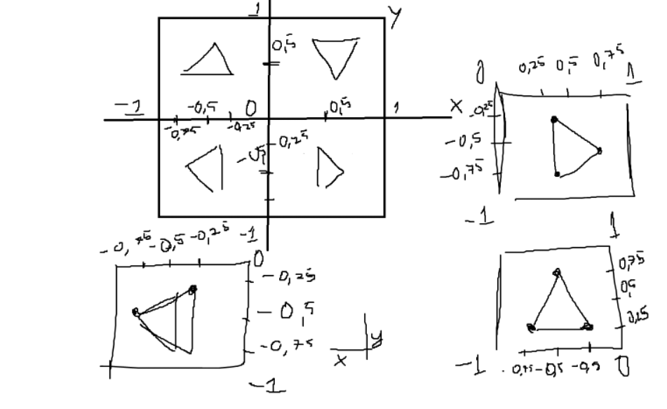
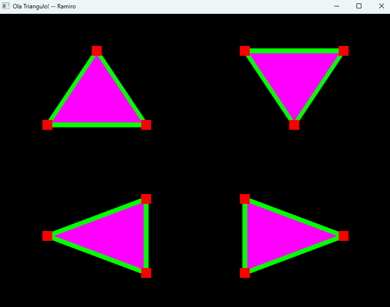
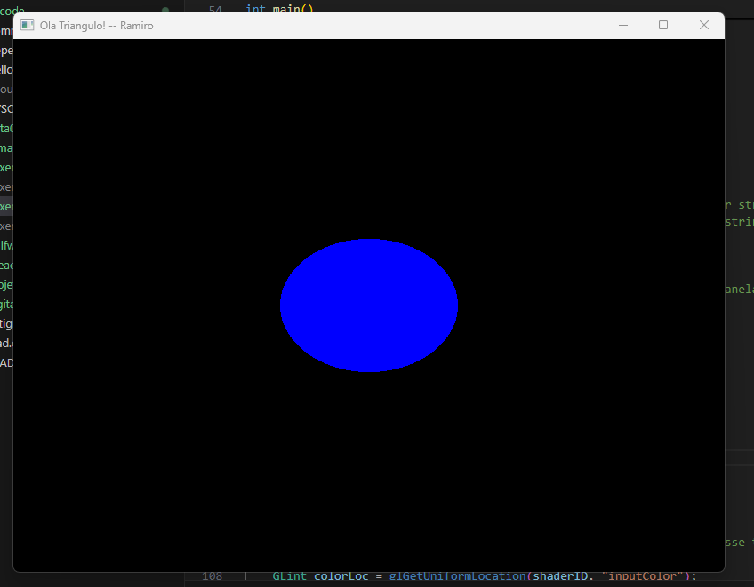
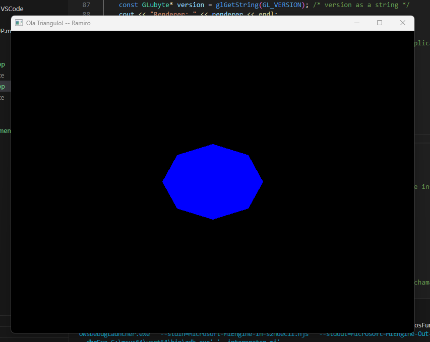
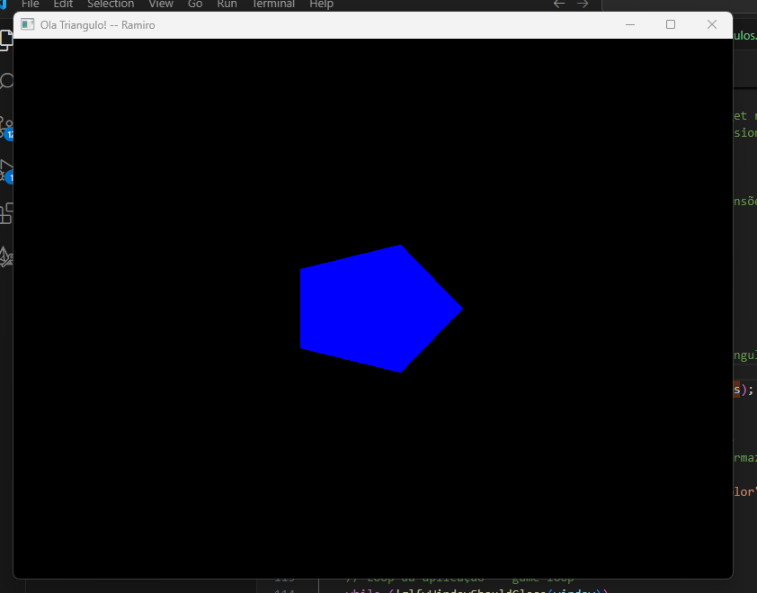
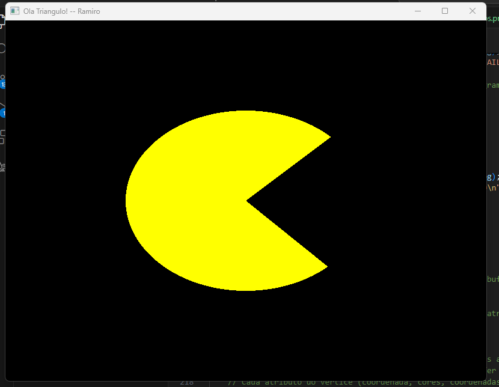
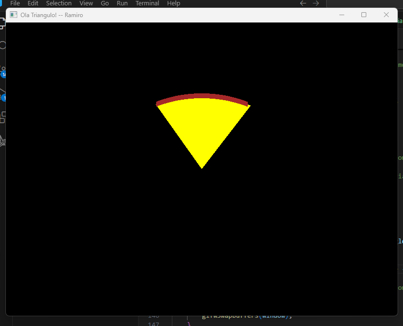

# Lista 01 - Ramiro Manoel

## exercício 05
Desenhei 4 triangulos no exercicio 5, um em cada quadrante, seguem as imagens e o link do código:

[Código exercicio 05](Exercicio05.cpp)




## exercício 06
Para o exercício 06, eu criei uma  função que criar os pontos de um circulo e devolve o objeto VAO, a funcão recebe 4 parametros:
* cordenada X central do círculo
* cordenada Y central do círculo
* tamanho do raio do círculo
* quantidade de vértices que vão compor o circulo (quanto mais vértices, mais detalhado será)

seguem as imagens e o link do código do exercício 06:

[Código exercicio 06](Exercicio06.cpp)

Círculo (numberOfVertices = 360):


Octagono (numberOfVertices = 8):


Pentagono (numberOfVertices = 5):


Pacman!
    Para fazer o pacman, criei uma nova função, a qual cria um circulo incompleto e podemos passar qual angulo começa nosso semi circulo e o angulo que termina, porém não podemos passar a quantidade de fragmentos, sempre será um fragmento por angulo existente no semicirculo.


Pizza
    para fazer a pizza utilizei a mesma função do Pacman, porém mudei os angulos de começo e de fim, e adicioei uma nova chamada do glDrawArrays, depois de mudar a cor, cortando os 3 primeiros números (centro do circulo) e utilizei o GL_LINE_STRIP para fazer a borda

    ```cpp
    glDrawArrays(GL_TRIANGLE_FAN, 0, endAngle - startAngle);
	glUniform4f(colorLoc, 0.65f, 0.16f, 0.16f, 1.0f);
	glDrawArrays(GL_LINE_STRIP, 3, endAngle - startAngle - 3);
    ```


DESAFIO: estrela
    fiz uma outra função que cria uma estrela, ela funciona como um circulo, porém com sempre 10 vertices e seu raio vai alternando entre o informado por parametro e a metade do mesmo.


(fiz essas funções, pois achei que apenas limitando a quantidade de leitura do glDrawArrays não atingiria meu objetivo da forma que queria, pelo menos sem os conhecimentos de rotação dos objetos)