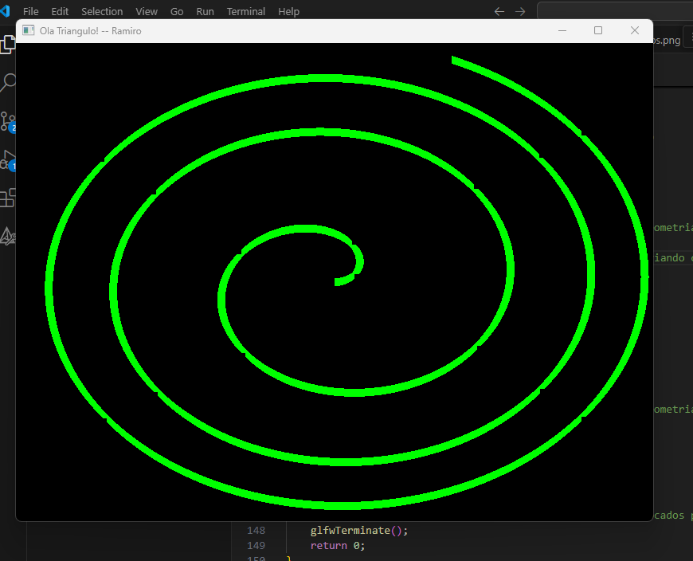
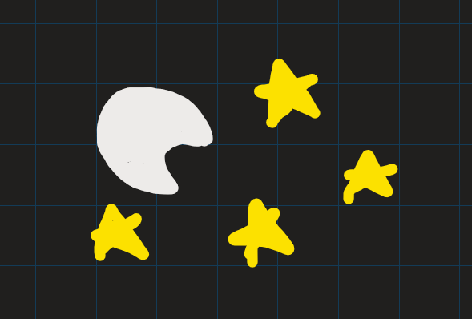
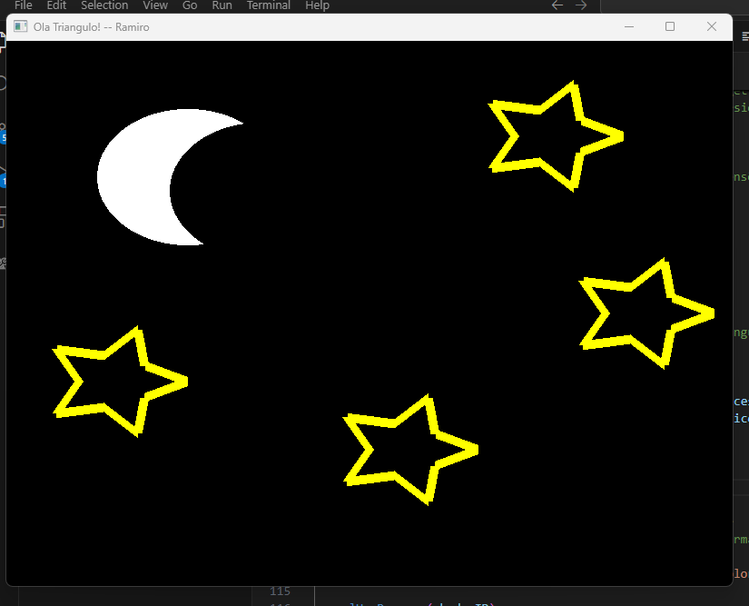

# Lista 01 - Ramiro Manoel

## exercício 01

* GLSL é uma línguagem de programação que permite o programador ter controle sobre o pipeline gráfico.
Os shaders obrigatórios são:
* Vertex Shader - Define como um vértice deve ser tratado (ainda no mundo 3D)
* Fragment Shaders - Define como uma área deve ser tratada (depois da rasterização)

## exercício 02

Primitivas gráficas são os elementos que utilizamos para contruir os desenhos, seguem alguns exemplos de primitivas gráficas do opengl vistos em aula:

* Poligono Preenchido - GL_TRIANGLES
* Poligono contorno - GL_LINE_LOOP
* Poligono vértices - GL_POINTS

Armazenamos os vértices através de buffers, eles contém todas as posições e informações de todos os vertices de determinado objeto que serão enviadas para serem processados.

## exercício 03

* VBO - Consiste no buffer que armazena todos os dados sobre os vértices, em forma de números em sequencia em um Array.
* VAO - É o buffer que informa como o VBO deve ser "quebrado" em vértices, ele que define quando começa e termina um vértice, quais dados do vértice são a posição, a cor, a textura, etc..., quantos bites tem um vértice, etc...
* EBO - O EBO serve para reutilizarmos os vértices, ao invés de escrevermos o mesmo repetidamente no VBO, indexamos um vértice com o EBO e reutilizamos o index.

## exercício 05
Desenhei 4 triangulos no exercicio 5, um em cada quadrante, seguem as imagens e o link do código:

[Código exercicio 05](Exercicio05.cpp)


## exercício 06
Para o exercício 06, eu criei uma  função que criar os pontos de um circulo e devolve o objeto VAO, a funcão recebe 4 parametros:
* cordenada X central do círculo
* cordenada Y central do círculo
* tamanho do raio do círculo
* quantidade de vértices que vão compor o circulo (quanto mais vértices, mais detalhado será)

seguem as imagens e o link do código do exercício 06:

[Código exercicio 06](Exercicio06.cpp)

### Círculo (numberOfVertices = 360):


### Octagono (numberOfVertices = 8):


### Pentagono (numberOfVertices = 5):


### Pacman!

 Para fazer o pacman, criei uma nova função, a qual cria um circulo incompleto e podemos passar qual angulo começa nosso semi circulo e o angulo que termina, porém não podemos passar a quantidade de fragmentos, sempre será um fragmento por angulo existente no semicirculo.


### Pizza
para fazer a pizza utilizei a mesma função do Pacman, porém mudei os angulos de começo e de fim, e adicioei uma nova chamada do glDrawArrays, depois de mudar a cor, cortando os 3 primeiros números (centro do circulo) e utilizei o GL_LINE_STRIP para fazer a borda

```cpp
glDrawArrays(GL_TRIANGLE_FAN, 0, endAngle - startAngle);
glUniform4f(colorLoc, 0.65f, 0.16f, 0.16f, 1.0f);
glDrawArrays(GL_LINE_STRIP, 3, endAngle - startAngle - 3);
```


### DESAFIO: estrela

fiz uma outra função que cria uma estrela, ela funciona como um circulo, porém com sempre 10 vertices e seu raio vai alternando entre o informado por parametro e a metade do mesmo.


(fiz essas funções, pois achei que apenas limitando a quantidade de leitura do glDrawArrays não atingiria meu objetivo da forma que queria, pelo menos sem os conhecimentos de rotação dos objetos)

## Exercício 07

seguem as imagens e o link do código do exercício 06:

[Código exercicio 07](Exercicio07.cpp)



## Exercício 08

### A)

#### VBO (Vertex Buffer Object) 
possuirá as informações relacionadas a posição dos vertices no plano X, Y e Z (Z será 0 por ser uma imagem 2D), e as informações relacionadas as cores RGB logo em sequencia, ficando algo do tipo:

ARRAY:
```c++
      X        Y        Z       R        G        B
     0.0,     0.5,     0.0,    1.0,     0.0,     0.0,
    -0.5,    -0.5,     0.0,    0.0,     1.0,     0.0,   
     0.5,    -0.5,     0.0,    0.0,     0.0,     1.0,   
```

#### VAO (Vertex Array Object)
Define qual VBO será utilizado por vez e define o formato deles
Temos então que definir qual o até onde um ponto do VBO vai, de onde até onde é sua posição e de onde até onde é sua cor.

Definimos com os parametros:
1. qual o atributo no vertex shader
2. quanto valores serão
3. qual o tipo dos valores
4. Se os dados precisam ser normalizados
5. qual o tamanho em bytes de um vertice
6. deslocamente para onde começa a encontrar o valor (posição vai do 0 ao 2, então começa no 0 // cor vai do 3 ao 5, então começa no 3)

```c++
//atributo posição
glVertexAttribPointer(0, 3, GL_FLOAT, GL_FALSE, 6 * sizeof(GLfloat), (GLvoid*)0);
glEnableVertexAttribArray(0);

//atributo cor
glVertexAttribPointer(1, 3, GL_FLOAT, GL_FALSE, 6 * sizeof(GLfloat), (GLvoid*) (3 * sizeof(GLfloat)));
glEnableVertexAttribArray(1);
```

#### EBO (Element Buffer Objects)

O EBO serve para armazenar indices de vertices, nesse caso, como é apenas um triangulo, não é necessario utilizar, já que eles não serão reutilizados.

### B)

No vertex shader definimos que o atributo zero será a posição e o atributo 1 será a cor, da seguinte forma:

```c++

const GLchar* vertexShaderSource = "#version 400\n"
"layout (location = 0) in vec3 position;\n"
"layout (location = 1) in vec3 color;\n"
"out vec3 vertexColor;\n"
"void main()\n"
"{\n"
"gl_Position = vec4(position.x, position.y, position.z, 1.0);\n"
"vertexColor = color;\n"
"}\0";

```

## Exercício 09

Seguem o desenho feito no papel quadriculado e o desenho feito com opengl, fiz uma noite estrelada para aproveitar a função do desafio anterios.
Fiz a lua com dois circulos sobrepostos, para dar a impressão de uma meia lua.

[link código exercício 09](Exercicio09.cpp)



