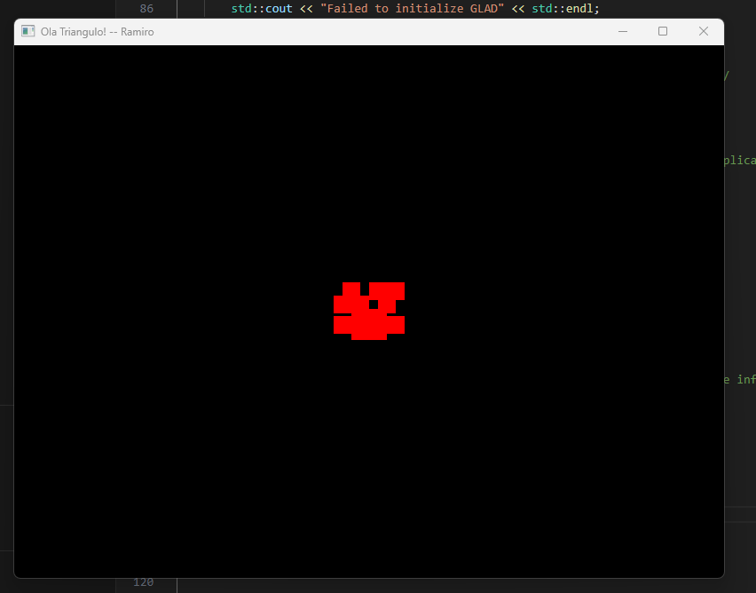
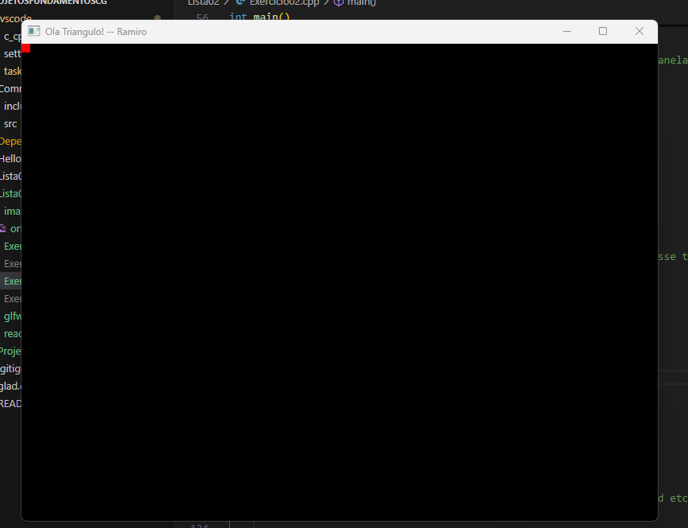

# Lista 02 - Ramiro Manoel

## exercício 01

Utilizei as bibliotecas glm:

```c++
#include <glm/glm.hpp>
#include <glm/gtc/matrix_transform.hpp>
#include <glm/gtc/type_ptr.hpp>
```

Vertex shader:

```c++
const GLchar* vertexShaderSource = "#version 400\n"
"layout (location = 0) in vec3 position;\n"
"uniform mat4 projection;\n"
"void main()\n"
"{\n"
"gl_Position = projection * vec4(position, 1.0);\n"
"}\0";
```

main:
```c++
glm::mat4 projection = glm::mat4(1);
projection = glm::ortho(-10.0, 10.0, -10.0, 10.0, -1.0, 1.0);

GLint projLoc = glGetUniformLocation(shaderID, "projection");
glUniformMatrix4fv(projLoc, 1, false, glm::value_ptr(projection));
```

Link do código e imagens:

[Link do código exercício 01](Exercicio01.cpp)

utilizei a mesma imagem do exercício 5 da lista 1, porém como estamos com um plano maior, só conseguimos ver os pixels vermelhos das pontas:



## exercício 02

Fiz a seguinte alteração em relação ao primeiro exercício:

```c++
projection = glm::ortho(0.0, 800.0, 600.0, 0.0, -1.0, 1.0);
```
Link do código e imagens:

[Link do código exercício 02](Exercicio02.cpp)

Podemos ver apenas um quadradinho vermelho na ponta esquerda superior, pois movemos noso plano para apenas um quadrante.



### exercício 03

Link do código e imagens:

[Link do código exercício 03](Exercicio03.cpp)

Ao desenharmos um triangulo da mesma forma de antes, temos um triangulo invertido, pois informamos que o y minimo é o 600 e o maximo é o 00, o que faz com que tenhamos um eixo y invertido, e o ponto 00 comece na esquerda em cima.


Essa configuração é util pois podemos criar nossos vértices com mais facilidade e entendimento dos pontos. Além disso, como temos um plano da mesma proporção da viewport, não temos mais a impressão de "achatamento" em nosso desenho.

### exercício 04

OBS: deixei o triangulo com a ponta para cima para realizar o exercício

Link do código e imagens:

[Link do código exercício 04](Exercicio04.cpp)

Alterei as dimensões para as seguintes:

```c++
projection = glm::ortho(-800.0, 800.0, 1200.0, 0.0, -1.0, 1.0);
```

* Dobrei a quantidade de Ymin - Assim consegui manter a forma do triangulo (não virei ele) e coloquei ele no quadrante superior.

* Adicionei -800 no Xmin, dessa forma, meu plano aumentou para esquerda, jogando meu triangulo para direita

* Resultado: O triangulo ficou no quadrante superior direito.


### exercício 05

Para adicionar os triangulos nos outros quadrantes, tive que adicioná-los ao array:

```c++
	GLfloat vertices[] = {
		//x   	y     z
		//T0
		 200.0, 450.00, 0.0, //v0
		 600.0, 450.00, 0.0, //v1
 		 400.0, 150.00, 0.0, //v2
		//T1
		 -200.0, 450.00, 0.0, //v0
		 -600.0, 450.00, 0.0, //v1
 		 -400.0, 150.00, 0.0, //v2
		//T2
		 200.0, 1050.00, 0.0, //v0
		 600.0, 1050.00, 0.0, //v1
 		 400.0, 750.00, 0.0, //v2
		//T3
		 -200.0, 1050.00, 0.0, //v0
		 -600.0, 1050.00, 0.0, //v1
 		 -400.0, 750.00, 0.0, //v2
	};
```

E adicionar a chamada deles no main:

```c++
glDrawArrays(GL_TRIANGLES, 0, 3);
glDrawArrays(GL_TRIANGLES, 3, 3);
glDrawArrays(GL_TRIANGLES, 6, 3);
glDrawArrays(GL_TRIANGLES, 9, 3);
```

O resultado ficou:

